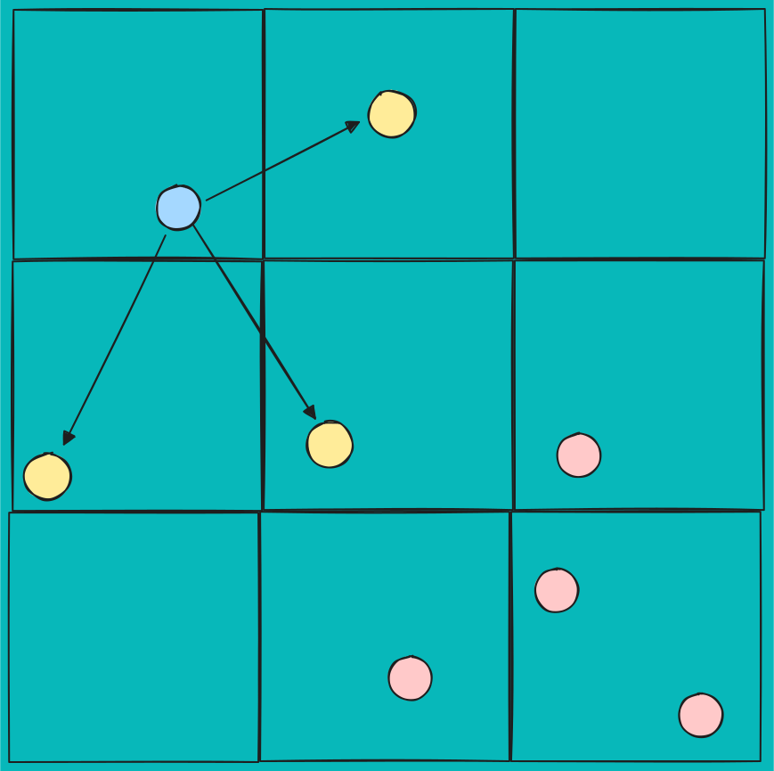
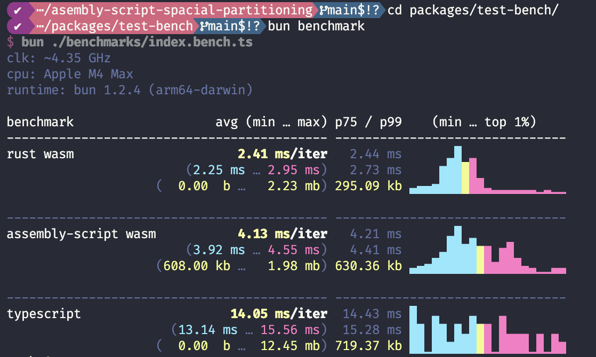

# @robertaron/spacial-partitioning

High performance spacial partitioning for javascript.


---

---
## Installation

```sh
npm install @robertaron/spacial-partitioning
```

---

## Example

Implementation of boids using the exported package can be seen [here](https://spacial-partitioning.vercel.app/)

## Usage

**Input**
- `positions`: Flat array of 3D coordinates (x, y, z, x, y, z, ...).
- `distance`: Maximum distance to consider two points as neighbors.

**Output** 
- `number[][]` that notates indexes of items that are within the provided distance.

```ts
import { init, createNearByGraph } from "@robertaron/spacial-partitioning";

// Initialize the WASM module (required before using createNearByGraph)
await init();
const positions = new Float32Array([
  0,   0,   0,
  1.5, 0,   0,
  1.5, 1.5, 0
  // ... more points
]);
const distance = 2
const neighborGraph = createNearByGraph(positions, distance);
// [
//   [1],  
//   [0,2],
//   [1],
// ]
```
---


### Notes

This repo includes 3 implementations of the same algorithm using `rust-wasm`,`assembly-script`, and `typescript`. The rust one is the one which is packaged.


### Performance

Benchmarks in `bun`

